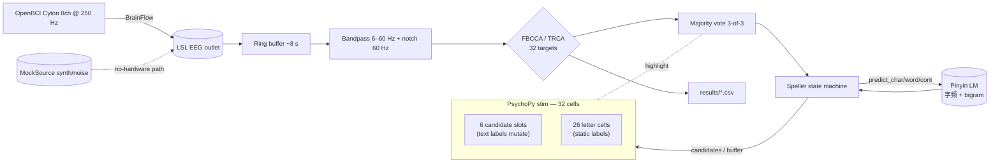

# SSVEP BCI — Chinese speller + offline benchmark + real-time demo

A portfolio-grade SSVEP brain-computer interface project. The headline app is
a **26-letter Chinese pinyin speller** with a candidate-row language model
that lets the user type Chinese characters/words by gazing at one letter and
then riding the prediction layer (`w → 我 → 想要 → 喝水`), cutting the typical
6+ gaze count per character down to 1–2.

The repo also keeps the foundational pieces:
- An offline benchmark suite reproducing PSDA / CCA / FBCCA / TRCA accuracy
  on **Wang2016** and **Nakanishi2015** via MOABB.
- A simpler 4-target real-time demo, kept as the algorithm sanity-check entry.

```
┌────────────────────────────────────────────────────────────┐
│  我想要喝水                                                  │   <- text buffer
├────────────────────────────────────────────────────────────┤
│ [喝水] [吃饭] [睡觉] [出去] [回家] [知道]                     │   <- 6 flickering
├────────────────────────────────────────────────────────────┤      candidate slots
│  a  b  c  d  e  f  g                                       │
│  h  i  j  k  l  m  n                                       │   <- 26 flickering
│  o  p  q  r  s  t  u                                       │      letter cells
│  v  w  x  y  z                                             │
└────────────────────────────────────────────────────────────┘
              32 SSVEP targets at 8.0..14.2 Hz (0.2 Hz spacing, Wang-style)
```

## Architecture



## Layout

```
src/
  algos/        base.py · psda.py · cca.py · fbcca.py · trca.py
  acquisition/  base.py · cyton.py · mock.py    (mock supports time-scheduled
                                                 target switching + noise rest)
  stimulus/     ssvep_stim.py        ← 4-target educational
                speller_stim.py      ← 26 letters + 6 candidates
  processing/   filters.py · pipeline.py
  speller/      layout.py · lm.py · state.py
  apps/         benchmark.py · live_demo.py · speller_demo.py
  utils/        config.py · metrics.py · plots.py
config/         default.yaml (4-target) · speller.yaml (32-target)
data/lm/        char_freq.json · char_to_words.json · word_bigram.json (optional)
docs/           hardware_setup.md
scripts/        build_lm.py
tests/          test_synthetic · test_pipeline · test_metrics · test_layout ·
                test_phase_cca · test_lm · test_speller_state · test_speller_pipeline
```

## Setup

```bash
conda activate ssvep   # python 3.10 + the listed deps
pip install -r requirements.txt
```

MOABB cache for the offline datasets is expected at `~/mne_data/`.

## How to run — four modes

### 1) Speller (headline demo)

```bash
# headless mock — auto-types "我想要喝水" via a scripted gaze schedule
python -m src.apps.speller_demo --source mock --no-stim --duration 30

# full PsychoPy UI on the laptop (no hardware needed)
python -m src.apps.speller_demo --source mock --duration 60

# with the OpenBCI Cyton
python -m src.apps.speller_demo --source cyton --algo fbcca
```

Expected stdout from the headless run:

```
[state] layer=letter action=letter:w           buffer=''        candidates=['我','为','问','外','完','望']
[state] layer=char   action=candidate:0->我    buffer='我'      candidates=['想要','需要','觉得',...]
[state] layer=word   action=candidate:0->想要  buffer='我想要'  candidates=['喝水','吃饭','睡觉',...]
[state] layer=word   action=candidate:0->喝水  buffer='我想要喝水'
```

To regenerate the LM resources from a Chinese corpus:

```bash
python scripts/build_lm.py --corpus path/to/corpus.txt
# writes data/lm/{char_freq,char_to_words,word_bigram}.json
```

The speller works without these — bundled fallback LM in `src/speller/lm.py`
covers the demo flow. Build resources for richer real-world prediction.

### 2) Offline benchmark

```bash
# full sweep
python -m src.apps.benchmark

# quick sanity check
python -m src.apps.benchmark --datasets Wang2016 --subjects 1 \
       --algos cca fbcca trca --windows 1 2
```

Outputs `results/benchmark.csv`, line plots, ITR bars, TRCA confusion
matrix, and pickles `models/trca_wang2016.pkl`. Expected 2 s-window
baselines on Wang2016: PSDA ~60 %, CCA ~80 %, FBCCA ~90 %, TRCA ~95 %.

### 3) Foundational 4-target real-time demo

Kept as a small algorithm-sanity entry — useful when validating a new
classifier independent of the speller's UI complexity.

```bash
python -m src.apps.live_demo --source mock --algo fbcca --no-stim --duration 10
python -m src.apps.live_demo --source cyton --algo trca \
       --trca-model models/trca_wang2016.pkl
```

### 4) Tests

```bash
pytest -q        # 36 passing
```

| file | what it asserts |
|---|---|
| `test_synthetic.py` | CCA / FBCCA / PSDA pick correct target on synthetic SSVEP at SNR ≥ 0 dB |
| `test_pipeline.py` | mock pipeline produces predictions and confirms 10 Hz |
| `test_phase_cca.py` | phase-aware reference signals plumb correctly + dense 32-freq grid separable |
| `test_layout.py` | freq grid generation correctness |
| `test_lm.py` | `predict_char("w")` includes 我; word/cont layers work |
| `test_speller_state.py` | 'w' → '我' → '想要' → '喝水' sequence advances buffer correctly |
| `test_speller_pipeline.py` | end-to-end mock+pipeline+state types '我' from synthetic EEG |
| `test_metrics.py` | Wolpaw ITR identities |

## Verification order

```bash
# 1. unit + integration tests (no hardware, no datasets) — ~18 s
pytest -q

# 2. headless mock speller
python -m src.apps.speller_demo --source mock --no-stim --duration 30

# 3. full UI mock speller (needs a 60 Hz display)
python -m src.apps.speller_demo --source mock --duration 60

# 4. benchmark sanity (subset of Wang2016 — verifies MOABB+epoching+CV)
python -m src.apps.benchmark --datasets Wang2016 --subjects 1 \
       --algos cca fbcca trca --windows 2

# 5. with hardware
python -m src.apps.speller_demo --source cyton --algo fbcca
```

## Why these design decisions

- **32 distinct frequencies, no phase coding.** Standard sin+cos CCA reference
  signals span a phase-invariant 2D subspace at each harmonic — JFPM phase
  discrimination requires per-subject TRCA training, which conflicts with
  "clone and run" zero-setup. 0.2 Hz spacing in 8.0–14.2 Hz is FBCCA-resolvable
  at a 2.5 s window. Phase plumbing is in the API for a future TRCA-on-JFPM
  extension.
- **LM in software, decoded by the same EEG pipeline.** EEG hardware is just a
  sensor. All UI / candidate prediction / decoding runs in Python so the same
  code paths drive both the mock simulation and live hardware.
- **Candidate cells flicker continuously, only their text labels mutate.**
  Toggling flicker would reset phase coherence and tank classification. Empty
  candidates render with empty strings.
- **Mock source supports `target_idx == -1` (pure noise rest).** Models the
  inter-trial gaze release a real user does between confirmations, so the
  pipeline's vote_window can actually break and accept a new commit.

## References

- Chen, X. et al. (2015) *Filter bank canonical correlation analysis for
  implementing a high-speed SSVEP-based brain–computer interface.* J. Neural
  Eng. 12 046008.
- Nakanishi, M. et al. (2018) *Enhancing detection of SSVEPs for a high-speed
  brain speller using task-related component analysis.* IEEE TBME 65(1).
- Wang, Y. et al. (2017) *A benchmark dataset for SSVEP-based BCIs.* IEEE
  TNSRE 25(10).
- Wolpaw, J. R. et al. (1998) *EEG-based communication: improved accuracy by
  response verification.* IEEE TRE 6(3).
