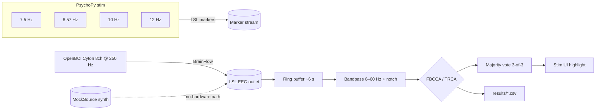

# SSVEP BCI — offline benchmark + real-time demo

A portfolio-grade SSVEP brain-computer interface project. Two tracks share one
codebase:

- **Offline track (A)** — reproduces benchmark numbers for PSDA, CCA, FBCCA
  (Chen et al. 2015) and TRCA on the public THU **Wang2016** and
  **Nakanishi2015** datasets via MOABB. Outputs accuracy, Wolpaw ITR, inference
  latency and figures into `results/`.
- **Online track (B)** — drives an OpenBCI Cyton over BrainFlow + LSL with a
  PsychoPy 4-square 7.5/8.57/10/12 Hz stimulator and a producer/consumer
  classification pipeline. A synthetic `mock` source lets you demo the full UI
  without any hardware.

## Architecture



## Layout

```
src/
  algos/      base.py · psda.py · cca.py · fbcca.py · trca.py
  acquisition/ base.py · cyton.py · mock.py
  stimulus/   ssvep_stim.py
  processing/ filters.py · pipeline.py
  apps/       benchmark.py · live_demo.py
  utils/      config.py · metrics.py · plots.py
config/default.yaml      # one source of truth
tests/                   # synthetic + pipeline
docs/hardware_setup.md   # Cyton dongle + electrode placement
models/                  # trca_wang2016.pkl saved by benchmark
results/                 # benchmark.csv + figures
```

## Setup

```bash
conda activate ssvep   # python 3.10 + the listed deps
pip install -r requirements.txt   # if any are missing
```

MOABB cache for both datasets is expected at `~/mne_data/`.

## How to run — three modes

### 1) Offline benchmark (公开数据集)

```bash
# full sweep (Wang2016 + Nakanishi2015, all algos × all windows × all subjects)
python -m src.apps.benchmark

# quick sanity check (one subject, two windows)
python -m src.apps.benchmark --datasets Wang2016 --subjects 1 \
       --algos cca fbcca trca --windows 1 2
```

Outputs:
- `results/benchmark.csv` — one row per (dataset, subject, algo, window).
- `results/acc_vs_window_<dataset>.png` — line plot.
- `results/itr_bar_<dataset>_2s.png` — ITR bar at 2 s window.
- `results/cm_<dataset>_S<subject>_trca.png` — TRCA confusion matrix.
- `models/trca_wang2016.pkl` — pickled TRCA model from the first Wang2016
  fold; consumed by the live demo when `--algo trca` is chosen.

Expected 2 s-window baselines on Wang2016 (THU): PSDA ~60 %, CCA ~80 %,
FBCCA ~90 %, TRCA ~95 %.

### 2) Real-time demo with hardware (OpenBCI Cyton + dongle)

See `docs/hardware_setup.md` for dongle pairing, electrode placement, and
impedance check.

```bash
# find the dongle on macOS
ls /dev/cu.usbserial-*
# update config/default.yaml -> acquisition.cyton.serial_port

python -m src.apps.live_demo --source cyton --algo fbcca
# or with the trained TRCA model
python -m src.apps.live_demo --source cyton --algo trca \
       --trca-model models/trca_wang2016.pkl
```

### 3) No-hardware mock demo (laptop only)

```bash
# headless: prints predictions to stdout, no PsychoPy window
python -m src.apps.live_demo --source mock --algo fbcca --no-stim --duration 20

# with the PsychoPy 4-square UI (requires a display)
python -m src.apps.live_demo --source mock --algo fbcca
```

## Tests

```bash
pytest -q
```

`tests/test_synthetic.py` injects a 12 Hz sinusoid (with harmonics + Gaussian
noise) into 8 channels and asserts CCA picks index `2` from `[8, 10, 12, 15] Hz`
at SNR ≥ 0 dB. `tests/test_pipeline.py` runs the full producer/consumer
pipeline against the mock source for 5 s and checks predictions / voting fire.

## Verification order — what to run, in this sequence

```bash
# 1. unit tests (no hardware, no datasets) — should be < 30 s
pytest -q

# 2. mock real-time demo (no hardware, no PsychoPy) — should print [pred] lines
python -m src.apps.live_demo --source mock --algo fbcca --no-stim --duration 10

# 3. one-subject benchmark sanity (no hardware, MOABB cache must exist)
python -m src.apps.benchmark --datasets Wang2016 --subjects 1 \
       --algos cca fbcca trca --windows 2

# 4. full benchmark (long; produces models/trca_wang2016.pkl + figures)
python -m src.apps.benchmark

# 5. (with hardware) live cyton demo
python -m src.apps.live_demo --source cyton --algo trca \
       --trca-model models/trca_wang2016.pkl
```

## References

- Chen, X. et al. (2015) *Filter bank canonical correlation analysis for
  implementing a high-speed SSVEP-based brain–computer interface.* J. Neural
  Eng. 12 046008.
- Nakanishi, M. et al. (2018) *Enhancing detection of SSVEPs for a high-speed
  brain speller using task-related component analysis.* IEEE TBME 65(1).
- Wang, Y. et al. (2017) *A benchmark dataset for SSVEP-based BCIs.* IEEE
  TNSRE 25(10).
- Wolpaw, J. R. et al. (1998) *EEG-based communication: improved accuracy by
  response verification.* IEEE TRE 6(3).
